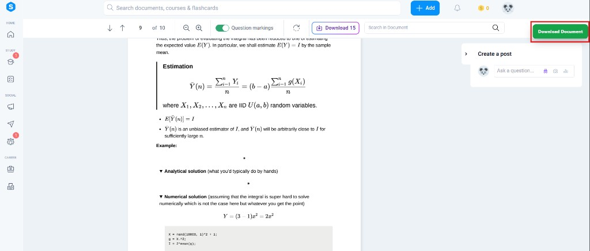

# Free StudyDrive Document Downloader (Chrome Extension)

This extension adds a **Download Document** button, you can download documents bypassing the StudyDrive paywall.

## Install (from GitHub)

- **Step 1**: On this GitHub repo page, click **Code**

- **Step 2**: Click **Download ZIP**

- **Step 3**: Right click the downloaded ZIP file and choose **Show in folder**

- **Step 4**: Extract the ZIP file (right-click → **Extract All…**)

- **Step 5**: Open Chrome and go to `chrome://extensions`, turn on **Developer mode**, then drag & drop the extracted file.

## Use

- **Step 1**: Open a StudyDrive document page like:
  - `https://www.studydrive.net/<language>/doc/...`
- **Step 2**: Look for the green **Download Document** button on the page (top-right)

- **Step 3**: Click it — the download should start automatically

## Update the extension (when this repo changes)

- Re-download the ZIP from GitHub and extract it (replace your old folder), **or**
- If you pulled changes into the same folder, go to `chrome://extensions` and click **Reload** on the extension card.

## Troubleshooting

- **Button not showing**
  - Make sure you’re on a URL that contains `/doc/`
  - Go to `chrome://extensions` → **Reload** the extension → refresh the StudyDrive tab (try **Ctrl+F5**)

- **It says “downloading” but nothing happens**
  - Try Chrome Downloads (`Ctrl+J`) to see if it started/failed
  - Reload the extension and try again

## Notes

- **Browser support**: tested on **Google Chrome**
