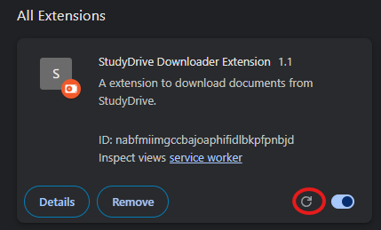

# Free StudyDrive Document Downloader (Chrome Extension)

This extension adds a **Download Document** button, you can download documents bypassing the StudyDrive paywall

## How to Install (from GitHub)

- **Step 1**: On this GitHub repo page, click **Code**

- **Step 2**: Click **Download ZIP**

- **Step 3**: Right click the downloaded ZIP file and choose **Show in folder**

- **Step 4**: Extract the ZIP file (right-click → **Extract All…**)

- **Step 5**: Open Chrome and go to `chrome://extensions`, turn on **Developer mode**, then drag & drop the extracted file

## After its downloaded; How to use
 Look for the green **Download Document** button on the page (top-right) and press it instead of the StudyDrive download button

## Update the extension if this repo changes

- After some time, when Study Drive fixes their paywall, we need to change the code
- What you have to do (as a user), go to `chrome://extensions` and click **Reload**
- You will find that the download button works again after the reload

## Troubleshooting

- **Button not showing**
  - Go to `chrome://extensions` → **Reload** the extension

- **It says “downloading” but nothing happens**
  - Check Chrome Downloads (`Ctrl+J`) to see if it started/failed

## Notes
- **Browser support**: tested on **Google Chrome**
